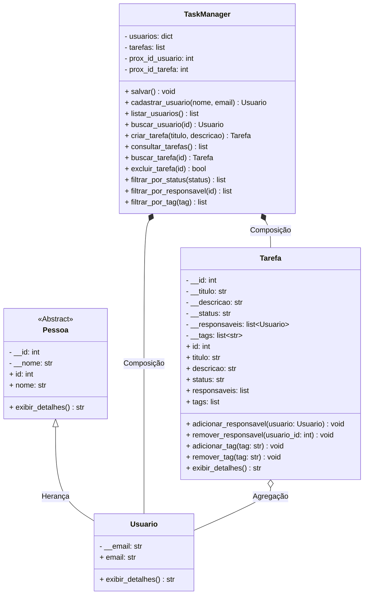

# Diagrama de Classes UML

```mermaid
classDiagram
    direction TB

    class Pessoa {
        <<Abstract>>
        - __id: int
        - __nome: str
        + id: int
        + nome: str
        + exibir_detalhes() str
    }

    class Usuario {
        - __email: str
        + email: str
        + exibir_detalhes() str
    }

    class Tarefa {
        - __id: int
        - __titulo: str
        - __descricao: str
        - __status: str
        - __responsaveis: list~Usuario~
        - __tags: list~str~
        + id: int
        + titulo: str
        + descricao: str
        + status: str
        + responsaveis: list
        + tags: list
        + adicionar_responsavel(usuario: Usuario) void
        + remover_responsavel(usuario_id: int) void
        + adicionar_tag(tag: str) void
        + remover_tag(tag: str) void
        + exibir_detalhes() str
    }

    class TaskManager {
        - usuarios: dict
        - tarefas: list
        - prox_id_usuario: int
        - prox_id_tarefa: int
        + salvar() void
        + cadastrar_usuario(nome, email) Usuario
        + listar_usuarios() list
        + buscar_usuario(id) Usuario
        + criar_tarefa(titulo, descricao) Tarefa
        + consultar_tarefas() list
        + buscar_tarefa(id) Tarefa
        + excluir_tarefa(id) bool
        + filtrar_por_status(status) list
        + filtrar_por_responsavel(id) list
        + filtrar_por_tag(tag) list
    }

    %% Relacionamentos
    Pessoa <|-- Usuario : Herança
    
    TaskManager *-- Usuario : Composição
    TaskManager *-- Tarefa : Composição
    
    Tarefa o-- Usuario : Agregação
```
