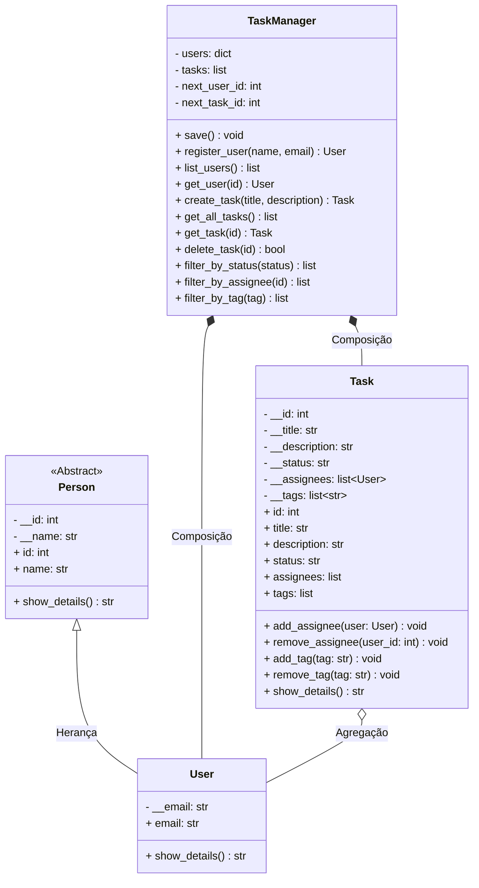

# Diagrama de Classes UML

```mermaid
classDiagram
    direction TB

    class Person {
        <<Abstract>>
        - __id: int
        - __name: str
        + id: int
        + name: str
        + show_details() str
    }

    class User {
        - __email: str
        + email: str
        + show_details() str
    }

    class Task {
        - __id: int
        - __title: str
        - __description: str
        - __status: str
        - __assignees: list~User~
        - __tags: list~str~
        + id: int
        + title: str
        + description: str
        + status: str
        + assignees: list
        + tags: list
        + add_assignee(user: User) void
        + remove_assignee(user_id: int) void
        + add_tag(tag: str) void
        + remove_tag(tag: str) void
        + show_details() str
    }

    class TaskManager {
        - users: dict
        - tasks: list
        - next_user_id: int
        - next_task_id: int
        + save() void
        + register_user(name, email) User
        + list_users() list
        + get_user(id) User
        + create_task(title, description) Task
        + get_all_tasks() list
        + get_task(id) Task
        + delete_task(id) bool
        + filter_by_status(status) list
        + filter_by_assignee(id) list
        + filter_by_tag(tag) list
    }

    %% Relacionamentos
    Person <|-- User : Herança
    
    TaskManager *-- User : Composição
    TaskManager *-- Task : Composição
    
    Task o-- User : Agregação
```
